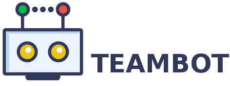

[](https://teambotclub.slack.com/messages/general)

Teambot is a Slack chatbot end-to-end solution that can be deployed to any infrastructure that can run Node.js. 
Teambot works with the [Express](http://expressjs.com/) web application framework and [BOTKIT](https://www.npmjs.com/package/botkit#advanced-topics).

# Getting Started

The fastest and easiest way to get started is to run MongoDB and Teambot locally.

## Running Teambot locally

### Prerequisites

- Node version - 6.9.4+
- bower (run `npm install -g bower`)
- MongoDB

### Setup
 
```
$ git clone https://github.com/teambot-club/teambot.git
$ npm install
$ mongod #optional if your local MongoDB is not started
$ node teambot.js
```

When you start Teambot for the first time you have to configure it to become part of your Slack team. 
Teambot requres to have a [Slack app](https://api.slack.com/slack-apps) with configured bot user.
Each Slack App has Client ID and Client Secret. The following Client ID and Client Secret are for Slack app associated with @testteambot user in [Teambot team](https://teambotclub.slack.com/signup).

- Navigate to http://localhost:8888
- Enter Slack Client ID
- Enter Slack Client Secret
- You will receive a message from your bot 
- ENJOY!

### Supported Arguments

Command line arguments can be passed to Teambot:

`node teambot.js -[argument_name] [argument_value]`

Argument      | Description                                                                                                               | Usage
--------------| -----------                                                                                                               | ------------
devskill      | Load loacal skill in Teambot. Usefull for skills development. The value should be `[skill-name]@[file:local_skill_path]`  | `node teambot.js -devskill "skill-name@file:./path/to/your/skill"`
              

## Folder Structure
- [bot](bot/README.MD)
    --- 
    This is the code that handles start/stop/restart of the Slack bot and provide some basic helper methods that expose functionality from Botkit (the heart of Teambot).
    Furthermore there logic that process every single message (a.k.a middleware) is located here.
    Teambot is designed as highly extensible chatbot solution having each functionality developed as separate `skill`. The loader of these skils is here as well. 

- [config](config/README.MD)
    ---
    There are 2 types of configuration that Teambot supports: default (used for local development) and production (for production usage).

    _TODO: Replace all configurations with commandline arguments._

- [portal](portal/README.MD)
    ---
    This is an AngularJS application. It's main purpose is to enable the end user to easily configure his Slack chatbot via Web interface.

- [server](server/README.MD)
    ---
    This is an Express server that provide services consumed by Teambot Portal. 


